<div align="center">

# Baibhav Kumar
### Software Developer · B.Tech CSE @ NIT Durgapur

</div>

---

<table>
<tr>
<td width="370" valign="top">

<!-- ASCII portrait (types itself in like a terminal on load) -->


</td>
<td width="490" valign="top">

<!-- Info card (neofetch-style panel, fades in alongside the portrait) -->


</td>
</tr>
</table>

<!-- Contribution heatmap (rebuilds every night via GitHub Actions) -->


---

<div align="center">

**📬 Connect with me**

[](https://linkedin.com/in/baibhav-kumar-541642332)
[](https://github.com/DSBaibhav)
[](https://www.instagram.com/_vaibhav0_8?igsh=MXhybHg1YWV1cHB3aw==)
[](mailto:baibhavsingh473@gmail.com)
[](https://drive.google.com/drive/folders/1wBocrvmhNGzy5XtUTxyDehjEgg_HF-sz)

</div>

---

<details>
<summary><b>🔧 To retune the portrait</b></summary>

```bash
# Adjust clipLimit (more = more contrast), then re-run ascii+preview:
nano scripts/prep_photo.py          # tweak clipLimit= in line 33
python3 scripts/prep_photo.py /path/to/photo.jpg source-prepped.png
STATIC=1 python3 scripts/make_ascii_svg.py && qlmanage -t -s 900 -o . avi-ascii.svg
# Tune CONTRAST / GAMMA / WHITE_FLOOR in make_ascii_svg.py for face brightness
```

</details>

<details>
<summary><b>📝 To edit the info panel</b></summary>

```bash
nano scripts/make_info_card.py      # edit the ROWS list at the top
python3 scripts/make_info_card.py
STATIC=1 python3 scripts/make_info_card.py && qlmanage -t -s 900 -o . info-card.svg
```

</details>
